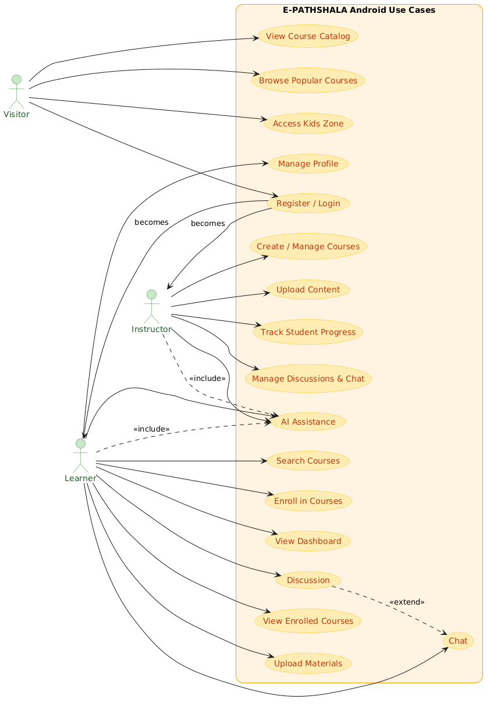

<!-- Logo on top --> 

 
   

 

<!-- Title --> 
<h1 align="center"> 
  📚 E-PATHSHALA – Smart E-Learning Platform 
</h1> 
<h3 align="center"> 
  <b style="color:purple;">🎓 A Modern Android-Based Learning System for Accessible, Personalized & Interactive Education</b> 
</h3> 

 
   
   
   
   

 
  
 

<!-- Abstract --> 

E-PATHSHALA is an Android-based e-learning platform designed to make education accessible, flexible, and engaging for learners of all ages.

The platform leverages modern technologies like Firebase and native Android development to provide seamless access to courses, interactive tools, and personalized learning experiences.

It bridges the gap between traditional education and digital learning, offering both self-paced and instructor-guided learning environments.

Keywords: E-learning, Android app, Firebase, digital education, personalized learning, online courses, AI assistant.

<!-- Introduction --> 

In today’s digital era, access to quality education is often limited by geographical, financial, and infrastructural barriers.

E-PATHSHALA addresses these challenges by providing:

🌍 Learning from anywhere  
💰 Affordable education options  
📱 Mobile-first accessibility  
🎯 Personalized learning experience  

It creates a unified environment where students and educators can connect, learn, and grow efficiently.

<!-- Objectives --> 

📚 Provide quality education accessible worldwide  
🎨 Enable personalized learning experiences  
🔗 Combine traditional teaching with digital tools  
👨‍🏫 Empower educators with course creation & management tools  

<!-- Feasibility --> 

### ⚙️ Technical Feasibility  
- 📱 Android Studio (Java) for native development  
- 🎨 XML for UI design  
- ☁️ Firebase for backend services  
- 🗄️ Firestore / Realtime DB for data storage  
- 🔐 Firebase Authentication for security  

### 💰 Economic Feasibility  
- 💵 Low initial development cost  
- 📦 Revenue via subscriptions & paid courses  
- 🤝 Collaboration with institutions  
- 📈 Scalable for long-term profitability  

### 🧩 Operational Feasibility  
- ✅ User-friendly interface  
- ⚡ Smooth performance  
- 🔐 Secure authentication & data handling  
- 👥 Clearly defined roles for users & instructors  

<!-- Use Case Diagram --> 

  

## 👥 Actors

1. 🌐 Visitor  
2. 🧑‍💻 Member  
3. 👨‍🏫 Instructor  

---

## 📖 Actor Descriptions

### 🌐 Visitor
A **non-registered user** who can access limited features of the platform.  
Visitors primarily explore the system before creating an account.

**Capabilities:**
- View course list  
- Browse popular courses  
- Access Kids Zone  
- Register and login  

---

### 🧑‍💻 Member
A **registered learner** who can access the platform’s full functionalities.  

**Capabilities:**
- Search courses  
- Enroll in courses  
- Upload course materials  
- Participate in discussions  
- Use chat system (real-time)  
- Access AI assistant (ChatGPT)  
- Browse content  
- View enrolled courses  
- Manage profile  

---

### 👨‍🏫 Instructor
A **registered content contributor** who can manage courses and monitor learners.  

**Capabilities:**
- Create and manage courses  
- Upload learning materials  
- Track student progress  
- Manage discussions & chat  
- Use AI assistant (ChatGPT)  

---

## 📌 Use Cases

### 🌐 Visitor Use Cases
1. Registration  
2. Login  
3. View Course List  
4. Popular Courses  
5. Kids Zone  

---

### 🧑‍💻 Member Use Cases
1. Search Courses  
2. Enroll in Courses  
3. Upload Course Material  
4. Discussion  
5. Chat  
6. ChatGPT Assistance  
7. Browse  
8. View Enrolled Courses  
9. Manage Profile  

---

### 👨‍🏫 Instructor Use Cases
1. Create / Manage Courses  
2. Upload Materials  
3. Track Student Progress  
4. Manage Discussions & Chat  
5. ChatGPT Assistance  

---

## 🔗 Relationships Between Use Cases

### 1. Discussion → Chat (Extend)
- Chat extends Discussion for deeper interaction.

### 2. Visitor → Member / Instructor Transition
- Registration/Login converts a Visitor into a Member or Instructor.

---

## ⚠️ Note

The **Use Case Diagram illustrates all actors and their core functionalities**.  
Visitor interactions are conceptually part of the system but shown outside the system boundary, while Member and Instructor use cases are fully inside the diagram.

<!-- System Modules --> 

👤 Visitor  
📝 Register account    
🔐 Login (Firebase Authentication)  
📚 View course list  
⭐ Explore popular courses  
🧒 Access Kids Zone   
👥 Member  
➕ Add courses  
🔍 Search courses  
📤 Upload materials  
💬 Participate in discussions  
📩 Chat with users (Real-time)  
🤖 Use AI assistant (ChatGPT)   
📊 View dashboard  
👤 Manage profile  
📚 Access enrolled courses   
🔁 Common  
✅ Account verification  

<!-- Key Features --> 

📚 Comprehensive course catalog  
🧒 Dedicated Kids Zone    
💬 Chat & discussion forums (Real-time)  
🤖 AI-powered ChatGPT assistant  
📤 Course material upload system  
📊 Personalized dashboard & analytics  
👤 Custom profile management  
🔗 Content sharing features  
🔐 Secure login & verification (Firebase)  
☁️ Real-time database sync  
🔎 Advanced course search  

<!-- App Screens --> 

🚀 Splash Screen  
📝 Registration Page  
🔐 Login Page  
🏠 Home Page  
📚 Courses Page  
🔍 Search Page  
📊 Dashboard  
📤 Upload Materials  
💬 Discussion Page  
🤖 ChatGPT Page  
👤 Profile Page  
🔗 Share App  
🚪 Logout  

<!-- Operating Environment --> 

📱 Platform: Android  
💻 Language: Java  
🏗️ IDE: Android Studio  
☁️ Backend: Firebase  
🗄️ Database: Firestore / Realtime DB  
🖥️ OS: Windows  

<!-- Future Work --> 

🚀 Mobile & Web synchronization for seamless cross-platform learning  
📊 Advanced analytics dashboard for student performance tracking  
🤖 Enhanced AI tutor with personalized recommendations  
🔐 Role-based access control with improved security  
💳 Integrated payment gateway for premium courses  

<!-- Conclusion --> 

E-PATHSHALA is a scalable and impactful digital learning solution that successfully integrates:

📚 Education  
📱 Technology  
🤝 Interaction  
🎯 Personalization  

It provides a strong foundation for future-ready education systems and has the potential to significantly improve learning accessibility and quality.

<!-- Author --> 

**A. K. M. Masudur Rahman (Gaurab)**   
🎓 Department of Computer Science and Engineering (CSE)    
🏫 Bangladesh Army University of Science and Technology (BAUST), Saidpur    
📧 Email: akmmasudurrahmangaurab@gmail.com  

<!-- Support --> 

If you like this project, consider giving it a ⭐ on GitHub!
